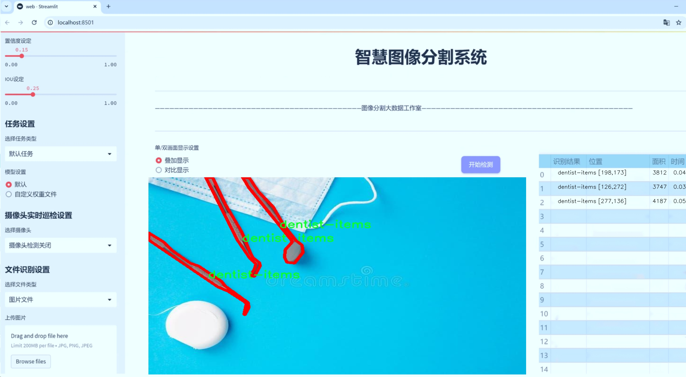
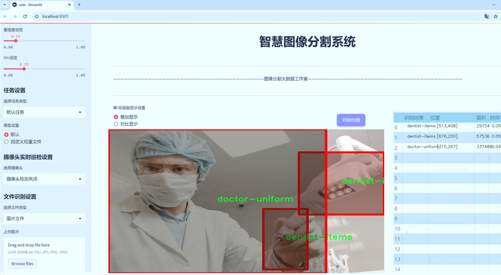
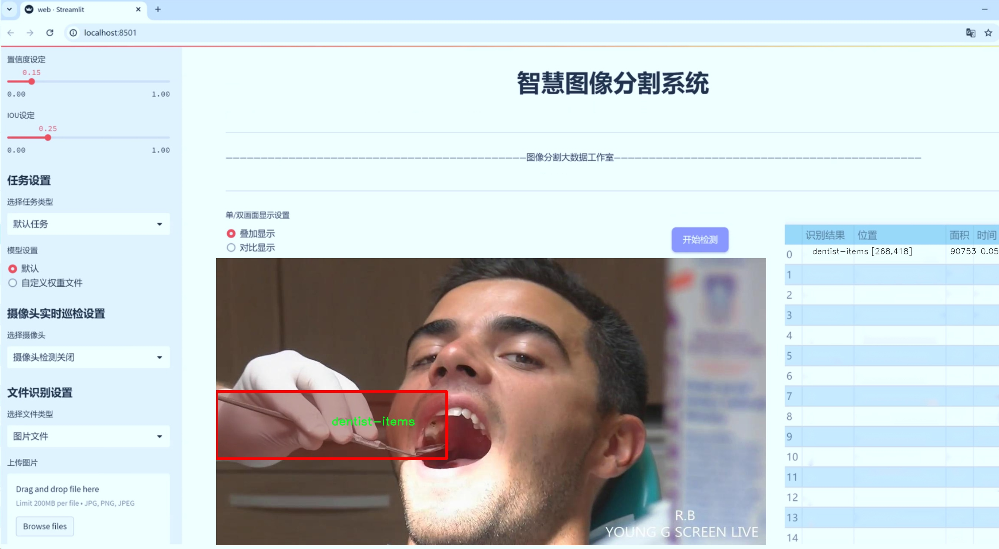
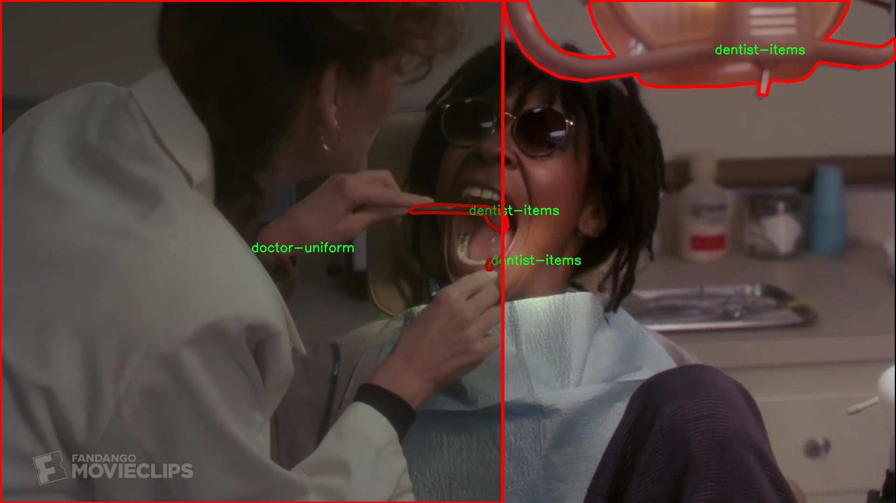
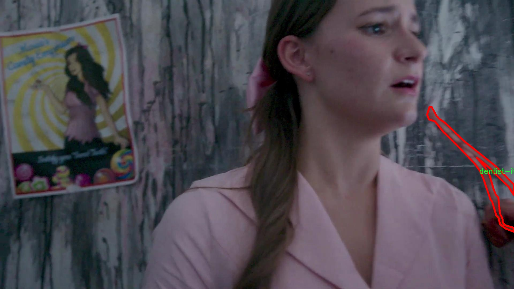
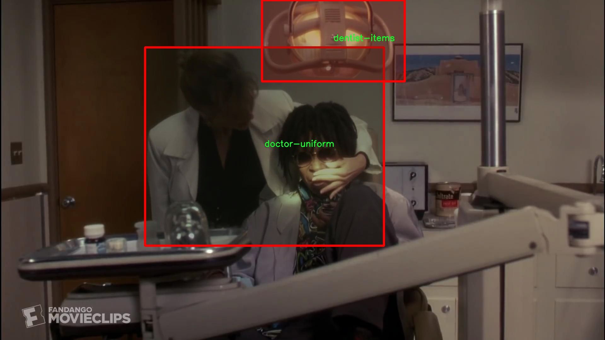
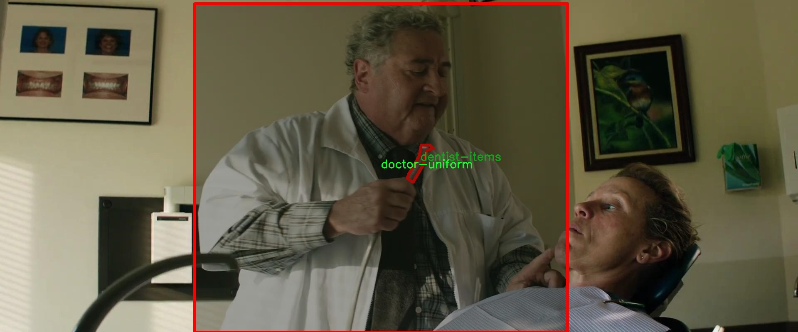
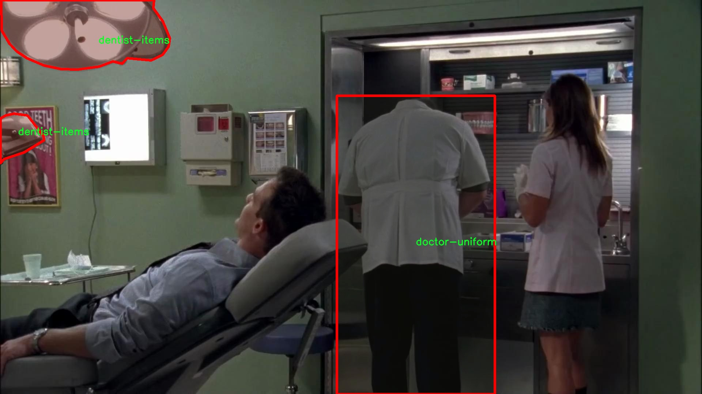

# 牙科设备分割系统： yolov8-seg-goldyolo

### 1.研究背景与意义

[参考博客](https://gitee.com/YOLOv8_YOLOv11_Segmentation_Studio/projects)

[博客来源](https://kdocs.cn/l/cszuIiCKVNis)

研究背景与意义

随着数字化技术的迅猛发展，牙科医疗行业也在不断向智能化和自动化迈进。牙科设备的准确识别与分割在临床应用中具有重要意义，它不仅可以提高医疗工作效率，还能降低人为操作的误差，提升患者的治疗体验。传统的牙科设备识别方法多依赖于人工经验，存在着识别精度低、处理速度慢等问题。因此，基于深度学习的图像分割技术，尤其是改进的YOLOv8模型，逐渐成为牙科设备自动识别与分割的研究热点。

YOLO（You Only Look Once）系列模型因其高效的实时检测能力和较好的精度而受到广泛关注。YOLOv8作为该系列的最新版本，在模型结构和算法优化上进行了多项改进，能够更好地处理复杂背景下的物体检测与分割任务。通过引入先进的卷积神经网络（CNN）架构和特征提取技术，YOLOv8在处理细粒度的图像分割任务时展现出优越的性能。这使得其在牙科设备的分割应用中，能够有效地识别和分离不同类别的设备，从而为后续的自动化操作提供支持。

本研究所使用的数据集包含1500张图像，涵盖了6个类别，包括牙科设备、医生制服、注射器等。这些类别的选择不仅体现了牙科医疗的多样性，也为模型的训练提供了丰富的样本数据。通过对这些图像进行标注和处理，研究者能够训练出一个高效的实例分割模型，能够在复杂的牙科环境中准确识别和分割各类设备。尤其是在临床实际应用中，能够快速、准确地识别出牙科设备，减少医生在操作过程中的负担，提高诊疗效率。

此外，基于改进YOLOv8的牙科设备分割系统的研究还具有重要的社会意义。随着人口老龄化的加剧，牙科疾病的发病率逐年上升，医疗资源的需求也随之增加。通过智能化的分割系统，可以有效提升牙科医疗的服务能力，缓解医疗资源紧张的问题。同时，该系统的推广应用也将推动牙科医疗的数字化转型，为医疗行业的可持续发展提供新的动力。

综上所述，基于改进YOLOv8的牙科设备分割系统的研究，不仅在技术上具有重要的创新意义，还在实际应用中展现出广阔的前景。通过对牙科设备的高效识别与分割，能够提升医疗服务的质量与效率，为患者提供更为优质的医疗体验。未来，随着深度学习技术的不断进步和数据集的不断丰富，基于YOLOv8的牙科设备分割系统将有望在更广泛的领域中得到应用，为牙科医疗行业的发展贡献力量。

### 2.图片演示







注意：本项目提供完整的训练源码数据集和训练教程,由于此博客编辑较早,暂不提供权重文件（best.pt）,需要按照6.训练教程进行训练后实现上图效果。

### 3.视频演示

[3.1 视频演示](https://www.bilibili.com/video/BV1EbmyYUE6N/)

### 4.数据集信息

##### 4.1 数据集类别数＆类别名

nc: 4
names: ['MR', 'dentist-items', 'doctor-uniform', 'syringe']


##### 4.2 数据集信息简介

数据集信息展示

在本研究中，我们使用了名为“dentist_seg”的数据集，以支持对牙科设备分割系统的训练，特别是针对改进YOLOv8-seg模型的应用。该数据集专门设计用于识别和分割牙科领域中常见的物品和设备，具有显著的实用价值和研究意义。数据集包含四个主要类别，分别是“MR”（医疗记录）、“dentist-items”（牙科物品）、“doctor-uniform”（医生制服）和“syringe”（注射器）。这些类别涵盖了牙科环境中最常见的元素，为模型的训练提供了丰富的样本和多样化的场景。

首先，类别“MR”代表医疗记录，这一类别在牙科诊所中至关重要，通常用于记录患者的病历、治疗方案及随访信息。通过对医疗记录的准确分割，系统能够帮助医生快速访问患者信息，提高诊疗效率。其次，“dentist-items”类别包括各种牙科工具和设备，如牙钻、探针、镜子等，这些物品是牙科操作中不可或缺的组成部分。通过对这些物品的有效识别和分割，模型可以帮助实现更高效的工具管理和使用，减少医疗过程中的误操作。

“doctor-uniform”类别则聚焦于医生的工作服，这一元素在牙科环境中不仅具有标识性，还与医疗安全和卫生标准密切相关。通过对医生制服的分割，系统能够在图像中准确识别出医务人员的存在，为后续的患者管理和安全监控提供数据支持。最后，“syringe”类别涉及注射器的识别，这在牙科治疗中经常被使用，尤其是在局部麻醉和药物注射过程中。对注射器的精确分割能够提高治疗的安全性和有效性，确保医生在操作时能够快速而准确地获取所需的工具。

整个“dentist_seg”数据集的构建不仅考虑了类别的多样性，还注重了数据的质量和标注的准确性。每个类别的样本均经过精心挑选和标注，确保模型在训练过程中能够学习到清晰的特征和边界。这一数据集的设计旨在模拟真实的牙科环境，提供丰富的场景变化和光照条件，以增强模型的泛化能力和鲁棒性。

通过使用“dentist_seg”数据集，我们的目标是提升YOLOv8-seg模型在牙科设备分割任务中的表现，使其能够在实际应用中实现高效、准确的分割效果。这不仅将为牙科诊疗提供技术支持，还可能推动相关领域的研究进展，促进智能医疗的发展。数据集的多样性和丰富性为模型的训练提供了坚实的基础，期待在未来的实验中，能够通过不断优化和调整模型架构，进一步提升分割精度和效率。











### 5.项目依赖环境部署教程（零基础手把手教学）

[5.1 环境部署教程链接（零基础手把手教学）](https://www.bilibili.com/video/BV1jG4Ve4E9t/?vd_source=bc9aec86d164b67a7004b996143742dc)


[5.2 安装Python虚拟环境创建和依赖库安装视频教程链接（零基础手把手教学）](https://www.bilibili.com/video/BV1nA4VeYEze/?vd_source=bc9aec86d164b67a7004b996143742dc)

### 6.手把手YOLOV8-seg训练视频教程（零基础手把手教学）

[6.1 手把手YOLOV8-seg训练视频教程（零基础小白有手就能学会）](https://www.bilibili.com/video/BV1cA4VeYETe/?vd_source=bc9aec86d164b67a7004b996143742dc)


按照上面的训练视频教程链接加载项目提供的数据集，运行train.py即可开始训练



     Epoch   gpu_mem       box       obj       cls    labels  img_size
     1/200     0G   0.01576   0.01955  0.007536        22      1280: 100%|██████████| 849/849 [14:42<00:00,  1.04s/it]
               Class     Images     Labels          P          R     mAP@.5 mAP@.5:.95: 100%|██████████| 213/213 [01:14<00:00,  2.87it/s]
                 all       3395      17314      0.994      0.957      0.0957      0.0843

     Epoch   gpu_mem       box       obj       cls    labels  img_size
     2/200     0G   0.01578   0.01923  0.007006        22      1280: 100%|██████████| 849/849 [14:44<00:00,  1.04s/it]
               Class     Images     Labels          P          R     mAP@.5 mAP@.5:.95: 100%|██████████| 213/213 [01:12<00:00,  2.95it/s]
                 all       3395      17314      0.996      0.956      0.0957      0.0845

     Epoch   gpu_mem       box       obj       cls    labels  img_size
     3/200     0G   0.01561    0.0191  0.006895        27      1280: 100%|██████████| 849/849 [10:56<00:00,  1.29it/s]
               Class     Images     Labels          P          R     mAP@.5 mAP@.5:.95: 100%|███████   | 187/213 [00:52<00:00,  4.04it/s]
                 all       3395      17314      0.996      0.957      0.0957      0.0845


### 7.50+种全套YOLOV8-seg创新点加载调参实验视频教程（一键加载写好的改进模型的配置文件）

[7.1 50+种全套YOLOV8-seg创新点加载调参实验视频教程（一键加载写好的改进模型的配置文件）](https://www.bilibili.com/video/BV1Hw4VePEXv/?vd_source=bc9aec86d164b67a7004b996143742dc)

### YOLOV8-seg算法简介

原始YOLOV8-seg算法原理

YOLOv8-seg算法是YOLO系列中的最新版本，代表了目标检测和图像分割领域的一次重要进步。该算法在YOLOv5的基础上进行了多项创新，旨在提升目标检测的精度和速度，尤其是在复杂背景下的小目标检测任务中。YOLOv8-seg采用了anchor-free的方法，避免了传统anchor-based方法的局限性，使得模型在处理不同尺度和形状的目标时更加灵活和高效。

YOLOv8-seg的网络结构主要由四个模块组成：输入端、主干网络、Neck端和输出端。输入端负责对输入图像进行预处理，包括Mosaic数据增强、自适应图像缩放和灰度填充等。这些预处理步骤不仅提高了模型的训练效率，还增强了模型对不同场景的适应能力。Mosaic增强操作通过将多张图像拼接在一起，迫使模型学习到更多的上下文信息，从而提高了对目标的识别能力。

在主干网络部分，YOLOv8-seg引入了C2F模块，这一模块的设计灵感来源于YOLOv7中的ELAN模块。C2F模块通过并行化多个梯度流分支，增强了特征提取的能力，使得模型能够捕捉到更丰富的特征信息。这种设计不仅提升了检测精度，还有效降低了模型的延迟，使得YOLOv8-seg在实时应用中表现优异。

Neck端采用了基于PAN（Path Aggregation Network）的结构，通过上采样和下采样操作对不同尺度的特征图进行融合。这一过程确保了模型能够充分利用不同层次的特征信息，从而提高了对小目标的检测能力。此外，YOLOv8-seg在Neck端引入了GSConv和Slim-neck技术，这些技术的应用在保持模型精度的同时，显著降低了计算量，使得模型在资源受限的环境中也能高效运行。

输出端则采用了Decoupled Head结构，这一结构的设计理念是将分类和回归过程解耦，从而提高了模型的灵活性和准确性。在传统的YOLO模型中，分类和回归共享同一卷积层，这在一定程度上限制了模型的性能。而在YOLOv8-seg中，分类和回归分别通过不同的卷积路径进行处理，使得模型能够更好地聚焦于各自的任务。此外，YOLOv8-seg还使用了Task-Aligned Assigner方法，通过对分类分数和回归分数进行加权，进一步提升了正样本的匹配效果。

为了应对小目标漏检的问题，YOLOv8-seg在网络中添加了一个更小的检测头，以增强对小目标的感知能力。该检测头的设计使得模型在面对复杂水面环境中的小目标漂浮物时，能够更准确地进行定位和识别。这一改进尤其适用于水面监测等实际应用场景，能够有效降低定位误差，提高目标感知能力。

在损失函数的设计上，YOLOv8-seg使用了MPDIoU损失函数替代了传统的CIoU损失函数。MPDIoU损失函数通过考虑目标的多种几何特征，提升了模型的泛化能力和精准度。这一改进使得YOLOv8-seg在面对多样化的目标和复杂背景时，能够保持较高的检测性能。

总的来说，YOLOv8-seg算法通过一系列的结构优化和技术创新，成功地提升了目标检测的精度和速度，尤其是在复杂环境下的小目标检测任务中表现出色。其anchor-free的设计理念和灵活的网络结构，使得YOLOv8-seg成为了目标检测和图像分割领域的一款强大工具。随着技术的不断进步，YOLOv8-seg有望在更多实际应用中发挥重要作用，为各类智能视觉系统提供强有力的支持。


### 9.系统功能展示（检测对象为举例，实际内容以本项目数据集为准）

图9.1.系统支持检测结果表格显示

  图9.2.系统支持置信度和IOU阈值手动调节

  图9.3.系统支持自定义加载权重文件best.pt(需要你通过步骤5中训练获得)

  图9.4.系统支持摄像头实时识别

  图9.5.系统支持图片识别

  图9.6.系统支持视频识别

  图9.7.系统支持识别结果文件自动保存

  图9.8.系统支持Excel导出检测结果数据


### 10.50+种全套YOLOV8-seg创新点原理讲解（非科班也可以轻松写刊发刊，V11版本正在科研待更新）

#### 10.1 由于篇幅限制，每个创新点的具体原理讲解就不一一展开，具体见下列网址中的创新点对应子项目的技术原理博客网址【Blog】：


[10.1 50+种全套YOLOV8-seg创新点原理讲解链接](https://gitee.com/qunmasj/good)

#### 10.2 部分改进模块原理讲解(完整的改进原理见上图和技术博客链接)【如果此小节的图加载失败可以通过CSDN或者Github搜索该博客的标题访问原始博客，原始博客图片显示正常】

### YOLOv8简介

按照官方描述，YOLOv8 是一个 SOTA 模型，它建立在以前 YOLO 版本的成功基础上，并引入了新的功能和改进，以进一步提升性能和灵活性。具体创新包括一个新的骨干网络、一个新的 Ancher-Free 检测头和一个新的损失函数，可以在从 CPU 到 GPU 的各种硬件平台上运行。

不过 ultralytics 并没有直接将开源库命名为 YOLOv8，而是直接使用 ultralytics 这个词，原因是 ultralytics 将这个库定位为算法框架，而非某一个特定算法，一个主要特点是可扩展性。其希望这个库不仅仅能够用于 YOLO 系列模型，而是能够支持非 YOLO 模型以及分类分割姿态估计等各类任务。
总而言之，ultralytics 开源库的两个主要优点是：

融合众多当前 SOTA 技术于一体
未来将支持其他 YOLO 系列以及 YOLO 之外的更多算法


下表为官方在 COCO Val 2017 数据集上测试的 mAP、参数量和 FLOPs 结果。可以看出 YOLOv8 相比 YOLOv5 精度提升非常多，但是 N/S/M 模型相应的参数量和 FLOPs 都增加了不少，从上图也可以看出相比 YOLOV5 大部分模型推理速度变慢了。


额外提一句，现在各个 YOLO 系列改进算法都在 COCO 上面有明显性能提升，但是在自定义数据集上面的泛化性还没有得到广泛验证，至今依然听到不少关于 YOLOv5 泛化性能较优异的说法。对各系列 YOLO 泛化性验证也是 MMYOLO 中一个特别关心和重点发力的方向。

### YOLO-MS简介
实时目标检测，以YOLO系列为例，已在工业领域中找到重要应用，特别是在边缘设备（如无人机和机器人）中。与之前的目标检测器不同，实时目标检测器旨在在速度和准确性之间追求最佳平衡。为了实现这一目标，提出了大量的工作：从第一代DarkNet到CSPNet，再到最近的扩展ELAN，随着性能的快速增长，实时目标检测器的架构经历了巨大的变化。

尽管性能令人印象深刻，但在不同尺度上识别对象仍然是实时目标检测器面临的基本挑战。这促使作者设计了一个强大的编码器架构，用于学习具有表现力的多尺度特征表示。具体而言，作者从两个新的角度考虑为实时目标检测编码多尺度特征：

从局部视角出发，作者设计了一个具有简单而有效的分层特征融合策略的MS-Block。受到Res2Net的启发，作者在MS-Block中引入了多个分支来进行特征提取，但不同的是，作者使用了一个带有深度卷积的 Inverted Bottleneck Block块，以实现对大Kernel的高效利用。

从全局视角出发，作者提出随着网络加深逐渐增加卷积的Kernel-Size。作者在浅层使用小Kernel卷积来更高效地处理高分辨率特征。另一方面，在深层中，作者采用大Kernel卷积来捕捉广泛的信息。

基于以上设计原则，作者呈现了作者的实时目标检测器，称为YOLO-MS。为了评估作者的YOLO-MS的性能，作者在MS COCO数据集上进行了全面的实验。还提供了与其他最先进方法的定量比较，以展示作者方法的强大性能。如图1所示，YOLO-MS在计算性能平衡方面优于其他近期的实时目标检测器。


具体而言，YOLO-MS-XS在MS COCO上获得了43%+的AP得分，仅具有450万个可学习参数和8.7亿个FLOPs。YOLO-MS-S和YOLO-MS分别获得了46%+和51%+的AP，可学习参数分别为810万和2220万。此外，作者的工作还可以作为其他YOLO模型的即插即用模块。通常情况下，作者的方法可以将YOLOv8的AP从37%+显著提高到40%+，甚至还可以使用更少的参数和FLOPs。


#### Multi-Scale Building Block Design
CSP Block是一个基于阶段级梯度路径的网络，平衡了梯度组合和计算成本。它是广泛应用于YOLO系列的基本构建块。已经提出了几种变体，包括YOLOv4和YOLOv5中的原始版本，Scaled YOLOv4中的CSPVoVNet，YOLOv7中的ELAN，以及RTMDet中提出的大Kernel单元。作者在图2(a)和图2(b)中分别展示了原始CSP块和ELAN的结构。


上述实时检测器中被忽视的一个关键方面是如何在基本构建块中编码多尺度特征。其中一个强大的设计原则是Res2Net，它聚合了来自不同层次的特征以增强多尺度表示。然而，这一原则并没有充分探索大Kernel卷积的作用，而大Kernel卷积已经在基于CNN的视觉识别任务模型中证明有效。将大Kernel卷积纳入Res2Net的主要障碍在于它们引入的计算开销，因为构建块采用了标准卷积。在作者的方法中，作者提出用 Inverted Bottleneck Block替代标准的3 × 3卷积，以享受大Kernel卷积的好处。

基于前面的分析，作者提出了一个带有分层特征融合策略的全新Block，称为MS-Block，以增强实时目标检测器在提取多尺度特征时的能力，同时保持快速的推理速度。

MS-Block的具体结构如图2(c)所示。假设是输入特征。通过1×1卷积的转换后，X的通道维度增加到n*C。然后，作者将X分割成n个不同的组，表示为，其中。为了降低计算成本，作者选择n为3。

注意，除了之外，每个其他组都经过一个 Inverted Bottleneck Block层，用表示，其中k表示Kernel-Size，以获得。的数学表示如下：


根据这个公式，该博客的作者不将 Inverted Bottleneck Block层连接，使其作为跨阶段连接，并保留来自前面层的信息。最后，作者将所有分割连接在一起，并应用1×1卷积来在所有分割之间进行交互，每个分割都编码不同尺度的特征。当网络加深时，这个1×1卷积也用于调整通道数。

#### Heterogeneous Kernel Selection Protocol
除了构建块的设计外，作者还从宏观角度探讨了卷积的使用。之前的实时目标检测器在不同的编码器阶段采用了同质卷积（即具有相同Kernel-Size的卷积），但作者认为这不是提取多尺度语义信息的最佳选项。

在金字塔结构中，从检测器的浅阶段提取的高分辨率特征通常用于捕捉细粒度语义，将用于检测小目标。相反，来自网络较深阶段的低分辨率特征用于捕捉高级语义，将用于检测大目标。如果作者在所有阶段都采用统一的小Kernel卷积，深阶段的有效感受野（ERF）将受到限制，影响大目标的性能。在每个阶段中引入大Kernel卷积可以帮助解决这个问题。然而，具有大的ERF的大Kernel可以编码更广泛的区域，这增加了在小目标外部包含噪声信息的概率，并且降低了推理速度。

在这项工作中，作者建议在不同阶段中采用异构卷积，以帮助捕获更丰富的多尺度特征。具体来说，在编码器的第一个阶段中，作者采用最小Kernel卷积，而最大Kernel卷积位于最后一个阶段。随后，作者逐步增加中间阶段的Kernel-Size，使其与特征分辨率的增加保持一致。这种策略允许提取细粒度和粗粒度的语义信息，增强了编码器的多尺度特征表示能力。

正如图所示，作者将k的值分别分配给编码器中的浅阶段到深阶段，取值为3、5、7和9。作者将其称为异构Kernel选择（HKS）协议。


作者的HKS协议能够在深层中扩大感受野，而不会对浅层产生任何其他影响。此外，HKS不仅有助于编码更丰富的多尺度特征，还确保了高效的推理。

如表1所示，将大Kernel卷积应用于高分辨率特征会产生较高的计算开销。然而，作者的HKS协议在低分辨率特征上采用大Kernel卷积，从而与仅使用大Kernel卷积相比，大大降低了计算成本。


在实践中，作者经验性地发现，采用HKS协议的YOLO-MS的推理速度几乎与仅使用深度可分离的3 × 3卷积相同。

#### Architecture
如图所示，作者模型的Backbone由4个阶段组成，每个阶段后面跟随1个步长为2的3 × 3卷积进行下采样。在第3个阶段后，作者添加了1个SPP块，与RTMDet中一样。在作者的编码器上，作者使用PAFPN作为Neck来构建特征金字塔[31, 35]。它融合了从Backbone不同阶段提取的多尺度特征。Neck中使用的基本构建块也是作者的MS-Block，在其中使用3 × 3深度可分离卷积进行快速推理。

此外，为了在速度和准确性之间取得更好的平衡，作者将Backbone中多级特征的通道深度减半。作者提供了3个不同尺度的YOLO-MS变体，即YOLO-MS-XS、YOLO-MS-S和YOLO-MS。不同尺度的YOLO-MS的详细配置列在表2中。对于YOLO-MS的其他部分，作者将其保持与RTMDet相同。


### 11.项目核心源码讲解（再也不用担心看不懂代码逻辑）

#### 11.1 ultralytics\utils\tuner.py

以下是对代码的核心部分进行提炼和详细注释的结果：

```python
# 导入必要的库
import subprocess
from ultralytics.cfg import TASK2DATA, TASK2METRIC, get_save_dir
from ultralytics.utils import DEFAULT_CFG, DEFAULT_CFG_DICT, LOGGER, NUM_THREADS

def run_ray_tune(model, space: dict = None, grace_period: int = 10, gpu_per_trial: int = None, max_samples: int = 10, **train_args):
    """
    使用 Ray Tune 进行超参数调优。

    参数:
        model (YOLO): 要进行调优的模型。
        space (dict, optional): 超参数搜索空间。默认为 None。
        grace_period (int, optional): ASHA 调度器的宽限期（以 epochs 为单位）。默认为 10。
        gpu_per_trial (int, optional): 每个试验分配的 GPU 数量。默认为 None。
        max_samples (int, optional): 最大试验次数。默认为 10。
        train_args (dict, optional): 传递给 `train()` 方法的附加参数。默认为 {}。

    返回:
        (dict): 包含超参数搜索结果的字典。
    """

    # 日志信息，提示用户了解 Ray Tune
    LOGGER.info('💡 Learn about RayTune at https://docs.ultralytics.com/integrations/ray-tune')

    # 尝试安装 Ray Tune
    try:
        subprocess.run('pip install ray[tune]'.split(), check=True)
        import ray
        from ray import tune
        from ray.air import RunConfig
        from ray.air.integrations.wandb import WandbLoggerCallback
        from ray.tune.schedulers import ASHAScheduler
    except ImportError:
        raise ModuleNotFoundError('调优超参数需要 Ray Tune。请使用: pip install "ray[tune]" 安装')

    # 检查是否安装了 wandb
    try:
        import wandb
        assert hasattr(wandb, '__version__')
    except (ImportError, AssertionError):
        wandb = False  # 如果没有安装 wandb，则设置为 False

    # 定义默认的超参数搜索空间
    default_space = {
        'lr0': tune.uniform(1e-5, 1e-1),  # 初始学习率
        'lrf': tune.uniform(0.01, 1.0),  # 最终学习率
        'momentum': tune.uniform(0.6, 0.98),  # 动量
        'weight_decay': tune.uniform(0.0, 0.001),  # 权重衰减
        'warmup_epochs': tune.uniform(0.0, 5.0),  # 预热 epochs
        'box': tune.uniform(0.02, 0.2),  # 边框损失增益
        'cls': tune.uniform(0.2, 4.0),  # 分类损失增益
        # 其他数据增强参数...
    }

    # 将模型放入 Ray 存储中
    model_in_store = ray.put(model)

    def _tune(config):
        """
        使用指定的超参数和附加参数训练 YOLO 模型。

        参数:
            config (dict): 用于训练的超参数字典。

        返回:
            None.
        """
        model_to_train = ray.get(model_in_store)  # 从 Ray 存储中获取模型
        model_to_train.reset_callbacks()  # 重置回调
        config.update(train_args)  # 更新配置
        results = model_to_train.train(**config)  # 训练模型
        return results.results_dict  # 返回结果字典

    # 获取搜索空间
    if not space:
        space = default_space  # 如果没有提供搜索空间，则使用默认值
        LOGGER.warning('WARNING ⚠️ 未提供搜索空间，使用默认搜索空间。')

    # 获取数据集
    data = train_args.get('data', TASK2DATA[model.task])  # 从训练参数中获取数据集
    space['data'] = data  # 将数据集添加到搜索空间
    if 'data' not in train_args:
        LOGGER.warning(f'WARNING ⚠️ 未提供数据集，使用默认数据集 "data={data}"。')

    # 定义可训练函数并分配资源
    trainable_with_resources = tune.with_resources(_tune, {'cpu': NUM_THREADS, 'gpu': gpu_per_trial or 0})

    # 定义 ASHA 调度器
    asha_scheduler = ASHAScheduler(time_attr='epoch',
                                   metric=TASK2METRIC[model.task],
                                   mode='max',
                                   max_t=train_args.get('epochs') or DEFAULT_CFG_DICT['epochs'] or 100,
                                   grace_period=grace_period,
                                   reduction_factor=3)

    # 定义超参数搜索的回调
    tuner_callbacks = [WandbLoggerCallback(project='YOLOv8-tune')] if wandb else []

    # 创建 Ray Tune 超参数搜索调优器
    tune_dir = get_save_dir(DEFAULT_CFG, name='tune').resolve()  # 获取保存目录
    tune_dir.mkdir(parents=True, exist_ok=True)  # 创建目录
    tuner = tune.Tuner(trainable_with_resources,
                       param_space=space,
                       tune_config=tune.TuneConfig(scheduler=asha_scheduler, num_samples=max_samples),
                       run_config=RunConfig(callbacks=tuner_callbacks, storage_path=tune_dir))

    # 运行超参数搜索
    tuner.fit()

    # 返回超参数搜索的结果
    return tuner.get_results()
```

### 代码分析
1. **导入模块**：导入了必要的库和模块，包括 `subprocess` 用于安装依赖，`ray` 和 `tune` 用于超参数调优。
2. **函数定义**：`run_ray_tune` 函数是进行超参数调优的核心函数，接收模型和调优参数。
3. **安装 Ray Tune**：尝试安装 Ray Tune，如果未安装则抛出异常。
4. **超参数空间**：定义了一个默认的超参数搜索空间，包括学习率、动量等。
5. **模型存储**：将模型放入 Ray 的存储中，以便在调优过程中访问。
6. **训练函数**：定义了 `_tune` 函数，负责根据给定的超参数训练模型。
7. **搜索空间和数据集**：检查是否提供了搜索空间和数据集，如果没有则使用默认值。
8. **调度器和回调**：设置 ASHA 调度器和可选的 Wandb 回调。
9. **调优器创建和运行**：创建调优器并运行超参数搜索，最后返回结果。

通过以上注释和分析，可以更清晰地理解代码的功能和结构。

这个文件是Ultralytics YOLO项目中的一个超参数调优工具，主要用于使用Ray Tune库对YOLO模型进行超参数优化。代码的核心功能是定义一个`run_ray_tune`函数，该函数接收模型和一系列超参数配置，并利用Ray Tune进行超参数搜索。

在函数的开始部分，首先通过日志记录器输出Ray Tune的相关信息，并检查传入的`train_args`是否为None，如果是，则初始化为空字典。接着，代码尝试安装Ray Tune库，如果安装失败，则抛出一个模块未找到的异常。随后，导入Ray及其相关模块，包括调度器和Wandb日志记录器。

接下来，定义了一个默认的超参数搜索空间，这些超参数包括学习率、动量、权重衰减、图像增强参数等。这些参数的范围是通过`uniform`函数定义的，表示在给定的范围内随机选择值。

在函数内部，首先将模型放入Ray的存储中，以便在后续的调优过程中可以被访问。然后定义了一个内部函数`_tune`，该函数接收一个配置字典作为参数，使用这些超参数训练YOLO模型，并返回训练结果。

接着，函数检查是否提供了自定义的超参数搜索空间，如果没有，则使用默认的搜索空间，并记录警告信息。同时，从`train_args`中获取数据集信息，如果未提供数据集，则使用默认值并记录警告。

然后，定义了一个可训练的函数`trainable_with_resources`，该函数将使用指定的CPU和GPU资源进行训练。接下来，设置了一个ASHAScheduler调度器，用于管理超参数搜索的进度，并定义了用于记录的回调函数（如果使用Wandb的话）。

在创建Ray Tune的超参数搜索器时，指定了参数空间、调度器、样本数量以及存储路径。最后，调用`tuner.fit()`开始超参数搜索，并返回搜索结果。

总的来说，这个文件提供了一个灵活的框架，允许用户在YOLO模型上进行高效的超参数调优，利用Ray Tune的分布式计算能力来加速搜索过程。

#### 11.2 ultralytics\models\yolo\segment\train.py

以下是经过简化和注释的代码，保留了核心部分并进行了详细的中文注释：

```python
# 导入必要的库和模块
from copy import copy
from ultralytics.models import yolo
from ultralytics.nn.tasks import SegmentationModel
from ultralytics.utils import DEFAULT_CFG, RANK
from ultralytics.utils.plotting import plot_images, plot_results

class SegmentationTrainer(yolo.detect.DetectionTrainer):
    """
    扩展DetectionTrainer类，用于基于分割模型的训练。
    示例用法：
        ```python
        from ultralytics.models.yolo.segment import SegmentationTrainer

        args = dict(model='yolov8n-seg.pt', data='coco8-seg.yaml', epochs=3)
        trainer = SegmentationTrainer(overrides=args)
        trainer.train()
        ```
    """

    def __init__(self, cfg=DEFAULT_CFG, overrides=None, _callbacks=None):
        """初始化SegmentationTrainer对象，接受配置和覆盖参数。"""
        if overrides is None:
            overrides = {}
        overrides['task'] = 'segment'  # 设置任务类型为分割
        super().__init__(cfg, overrides, _callbacks)  # 调用父类构造函数

    def get_model(self, cfg=None, weights=None, verbose=True):
        """返回初始化的SegmentationModel，使用指定的配置和权重。"""
        # 创建SegmentationModel实例，设置输入通道数和类别数
        model = SegmentationModel(cfg, ch=3, nc=self.data['nc'], verbose=verbose and RANK == -1)
        if weights:
            model.load(weights)  # 如果提供权重，则加载权重

        return model  # 返回模型实例

    def get_validator(self):
        """返回SegmentationValidator实例，用于YOLO模型的验证。"""
        self.loss_names = 'box_loss', 'seg_loss', 'cls_loss', 'dfl_loss'  # 定义损失名称
        # 创建并返回SegmentationValidator实例
        return yolo.segment.SegmentationValidator(self.test_loader, save_dir=self.save_dir, args=copy(self.args))

    def plot_training_samples(self, batch, ni):
        """创建训练样本图像的绘图，包括标签和框坐标。"""
        plot_images(batch['img'],  # 图像数据
                    batch['batch_idx'],  # 批次索引
                    batch['cls'].squeeze(-1),  # 类别标签
                    batch['bboxes'],  # 边界框
                    batch['masks'],  # 掩码
                    paths=batch['im_file'],  # 图像文件路径
                    fname=self.save_dir / f'train_batch{ni}.jpg',  # 保存文件名
                    on_plot=self.on_plot)  # 绘图回调

    def plot_metrics(self):
        """绘制训练和验证指标。"""
        plot_results(file=self.csv, segment=True, on_plot=self.on_plot)  # 保存结果图像
```

### 代码核心部分解释：
1. **SegmentationTrainer类**：这是一个用于训练分割模型的类，继承自YOLO的检测训练器。
2. **初始化方法**：在初始化时设置任务类型为分割，并调用父类的初始化方法。
3. **get_model方法**：用于创建和返回一个分割模型实例，支持加载预训练权重。
4. **get_validator方法**：返回一个验证器实例，用于评估模型的性能。
5. **plot_training_samples方法**：用于可视化训练样本，包括图像、标签和边界框。
6. **plot_metrics方法**：用于绘制训练和验证过程中的指标图。

这个程序文件是用于训练YOLO（You Only Look Once）模型的分割（Segmentation）任务的，文件名为`train.py`，属于Ultralytics YOLO框架的一部分。该文件定义了一个名为`SegmentationTrainer`的类，继承自`DetectionTrainer`类，专门用于处理图像分割任务。

在文件的开头，导入了一些必要的模块和类，包括`copy`模块、YOLO模型、分割模型、默认配置、以及一些用于绘图的工具。接下来，`SegmentationTrainer`类的定义开始了。

该类的构造函数`__init__`接受三个参数：`cfg`（配置），`overrides`（覆盖参数），和`_callbacks`（回调函数）。如果没有提供`overrides`，则将其初始化为空字典。然后，它将任务类型设置为`segment`，并调用父类的构造函数进行初始化。

`get_model`方法用于返回一个初始化好的分割模型`SegmentationModel`，该模型根据传入的配置和权重进行初始化。如果提供了权重参数，则会加载相应的权重。

`get_validator`方法返回一个`SegmentationValidator`实例，用于对YOLO模型进行验证。在这个方法中，定义了损失名称，包括边框损失、分割损失、分类损失和分布式焦点损失。

`plot_training_samples`方法用于创建训练样本图像的可视化，包括标签和边框坐标。它使用`plot_images`函数将训练批次的图像绘制出来，并保存为JPEG文件。

最后，`plot_metrics`方法用于绘制训练和验证过程中的指标，调用`plot_results`函数将结果保存为PNG文件。

总体而言，这个文件的主要功能是提供一个框架，方便用户使用YOLO模型进行图像分割任务的训练、验证和结果可视化。用户可以通过创建`SegmentationTrainer`的实例并调用`train`方法来启动训练过程。

#### 11.3 web.py

以下是代码中最核心的部分，并附上详细的中文注释：

```python
import cv2
import numpy as np
from PIL import ImageFont, ImageDraw, Image
from hashlib import md5

def calculate_polygon_area(points):
    """
    计算多边形的面积，输入应为一个 Nx2 的numpy数组，表示多边形的顶点坐标
    """
    if len(points) < 3:  # 多边形至少需要3个顶点
        return 0
    return cv2.contourArea(points)

def draw_with_chinese(image, text, position, font_size=20, color=(255, 0, 0)):
    """
    在OpenCV图像上绘制中文文字
    """
    # 将图像从 OpenCV 格式（BGR）转换为 PIL 格式（RGB）
    image_pil = Image.fromarray(cv2.cvtColor(image, cv2.COLOR_BGR2RGB))
    draw = ImageDraw.Draw(image_pil)
    # 使用指定的字体
    font = ImageFont.truetype("simsun.ttc", font_size, encoding="unic")
    draw.text(position, text, font=font, fill=color)
    # 将图像从 PIL 格式（RGB）转换回 OpenCV 格式（BGR）
    return cv2.cvtColor(np.array(image_pil), cv2.COLOR_RGB2BGR)

def generate_color_based_on_name(name):
    """
    使用哈希函数生成稳定的颜色
    """
    hash_object = md5(name.encode())
    hex_color = hash_object.hexdigest()[:6]  # 取前6位16进制数
    r, g, b = int(hex_color[0:2], 16), int(hex_color[2:4], 16), int(hex_color[4:6], 16)
    return (b, g, r)  # OpenCV 使用BGR格式

def draw_detections(image, info, alpha=0.2):
    """
    在图像上绘制检测结果，包括边界框和标签
    """
    name, bbox, conf, cls_id, mask = info['class_name'], info['bbox'], info['score'], info['class_id'], info['mask']
    x1, y1, x2, y2 = bbox
    # 绘制边界框
    cv2.rectangle(image, (x1, y1), (x2, y2), color=(0, 0, 255), thickness=3)
    # 绘制类别名称
    image = draw_with_chinese(image, name, (x1, y1 - 10), font_size=20)
    return image

def frame_process(image, model, conf_threshold=0.15, iou_threshold=0.5):
    """
    处理并预测单个图像帧的内容。
    Args:
        image (numpy.ndarray): 输入的图像。
        model: 预测模型。
        conf_threshold (float): 置信度阈值。
        iou_threshold (float): IOU阈值。
    Returns:
        tuple: 处理后的图像，检测信息。
    """
    pre_img = model.preprocess(image)  # 对图像进行预处理
    params = {'conf': conf_threshold, 'iou': iou_threshold}
    model.set_param(params)  # 设置模型参数
    pred = model.predict(pre_img)  # 使用模型进行预测
    det_info = model.postprocess(pred)  # 后处理预测结果

    # 初始化检测信息
    detInfo = []
    if det_info is not None and len(det_info):
        for info in det_info:
            # 绘制检测框和标签
            image = draw_detections(image, info)
            detInfo.append(info)  # 添加检测信息
    return image, detInfo

# 示例：使用模型处理图像
# model = ...  # 加载模型
# image = cv2.imread('path_to_image.jpg')  # 读取图像
# processed_image, detections = frame_process(image, model)
# cv2.imshow('Processed Image', processed_image)
# cv2.waitKey(0)
# cv2.destroyAllWindows()
```

### 代码说明：
1. **calculate_polygon_area**: 计算多边形的面积，使用OpenCV的`contourArea`函数。
2. **draw_with_chinese**: 在图像上绘制中文文本，使用PIL库处理中文字体。
3. **generate_color_based_on_name**: 根据名称生成稳定的颜色，使用MD5哈希函数。
4. **draw_detections**: 在图像上绘制检测结果，包括边界框和类别名称。
5. **frame_process**: 处理输入图像，进行预处理、预测，并绘制检测结果。

这些函数是图像处理和目标检测的核心部分，能够完成从图像读取到结果绘制的完整流程。

这个程序文件 `web.py` 是一个基于 Streamlit 的图像分割和目标检测系统，主要用于实时处理摄像头输入或上传的图像和视频。程序的核心功能包括加载模型、处理输入数据、进行目标检测、绘制检测结果以及展示结果。

首先，程序导入了必要的库，包括用于图像处理的 OpenCV、用于数据处理的 NumPy、用于创建 Web 应用的 Streamlit，以及其他一些辅助工具和自定义模块。接着，定义了一些辅助函数，例如计算多边形面积、在图像上绘制中文文本、生成基于名称的颜色等。这些函数在后续的图像处理和结果展示中起到了重要作用。

接下来，定义了一个 `Detection_UI` 类，该类负责整个检测系统的界面和逻辑。类的初始化方法中，设置了一些基本参数，如模型类型、置信度阈值、IOU 阈值等，并加载了可用的摄像头列表和模型。模型的加载包括从指定路径加载预训练的权重，并为每个类别分配随机颜色。

在 `setup_page` 和 `setup_sidebar` 方法中，设置了页面的布局和侧边栏的内容，包括模型设置、摄像头选择和文件上传选项。用户可以通过侧边栏选择任务类型、调整阈值、选择摄像头或上传文件进行检测。

`process_camera_or_file` 方法是处理输入的核心逻辑。如果用户选择了摄像头输入，程序会使用 OpenCV 捕获摄像头画面并进行实时检测；如果用户上传了图像或视频文件，程序会读取文件并进行处理。处理过程中，程序会调用 `frame_process` 方法，该方法负责对每一帧图像进行预处理、模型预测和后处理，最终绘制检测框和标签。

检测结果会通过 `logTable` 记录下来，并在界面上以表格形式展示。用户可以通过按钮导出结果，保存检测记录到 CSV 文件中。

在绘制检测结果时，程序会根据检测到的目标信息在图像上绘制边框、标签、面积等信息，并根据用户选择的显示模式（叠加显示或对比显示）更新图像展示。

最后，程序通过 `if __name__ == "__main__":` 语句实例化 `Detection_UI` 类并运行应用，启动整个检测系统。

总体来说，这个程序实现了一个功能齐全的图像分割和目标检测系统，能够实时处理视频流和静态图像，提供用户友好的界面和交互体验。

#### 11.4 ultralytics\utils\dist.py

以下是代码中最核心的部分，并附上详细的中文注释：

```python
import os
import re
import shutil
import socket
import sys
import tempfile
from pathlib import Path

def find_free_network_port() -> int:
    """
    查找本地主机上可用的端口。

    在单节点训练时，如果不想连接到真实的主节点，但需要设置
    `MASTER_PORT` 环境变量时，这个函数非常有用。
    """
    with socket.socket(socket.AF_INET, socket.SOCK_STREAM) as s:
        s.bind(('127.0.0.1', 0))  # 绑定到本地地址和随机端口
        return s.getsockname()[1]  # 返回分配的端口号


def generate_ddp_file(trainer):
    """生成 DDP 文件并返回其文件名。"""
    # 获取训练器的模块和类名
    module, name = f'{trainer.__class__.__module__}.{trainer.__class__.__name__}'.rsplit('.', 1)

    # 创建 DDP 文件的内容
    content = f'''overrides = {vars(trainer.args)} \nif __name__ == "__main__":
    from {module} import {name}
    from ultralytics.utils import DEFAULT_CFG_DICT

    cfg = DEFAULT_CFG_DICT.copy()
    cfg.update(save_dir='')   # 处理额外的键 'save_dir'
    trainer = {name}(cfg=cfg, overrides=overrides)
    trainer.train()'''
    
    # 创建 DDP 目录（如果不存在）
    (USER_CONFIG_DIR / 'DDP').mkdir(exist_ok=True)
    
    # 创建临时文件并写入内容
    with tempfile.NamedTemporaryFile(prefix='_temp_',
                                     suffix=f'{id(trainer)}.py',
                                     mode='w+',
                                     encoding='utf-8',
                                     dir=USER_CONFIG_DIR / 'DDP',
                                     delete=False) as file:
        file.write(content)  # 写入内容到临时文件
    return file.name  # 返回临时文件的名称


def generate_ddp_command(world_size, trainer):
    """生成并返回分布式训练的命令。"""
    import __main__  # 本地导入以避免特定问题
    if not trainer.resume:
        shutil.rmtree(trainer.save_dir)  # 如果不恢复训练，删除保存目录
    
    file = str(Path(sys.argv[0]).resolve())  # 获取当前脚本的绝对路径
    safe_pattern = re.compile(r'^[a-zA-Z0-9_. /\\-]{1,128}$')  # 允许的字符和最大长度限制
    # 检查文件名是否安全且存在，并且以 .py 结尾
    if not (safe_pattern.match(file) and Path(file).exists() and file.endswith('.py')):
        file = generate_ddp_file(trainer)  # 生成 DDP 文件
    
    dist_cmd = 'torch.distributed.run' if TORCH_1_9 else 'torch.distributed.launch'  # 根据 PyTorch 版本选择命令
    port = find_free_network_port()  # 查找可用端口
    # 构建命令列表
    cmd = [sys.executable, '-m', dist_cmd, '--nproc_per_node', f'{world_size}', '--master_port', f'{port}', file]
    return cmd, file  # 返回命令和文件名


def ddp_cleanup(trainer, file):
    """如果创建了临时文件，则删除它。"""
    if f'{id(trainer)}.py' in file:  # 检查文件名是否包含临时文件的后缀
        os.remove(file)  # 删除临时文件
```

### 代码核心部分说明：
1. **查找可用端口**：`find_free_network_port` 函数用于查找本地主机上可用的网络端口，避免端口冲突。
2. **生成 DDP 文件**：`generate_ddp_file` 函数创建一个临时 Python 文件，包含训练器的配置和训练逻辑，便于分布式训练使用。
3. **生成分布式训练命令**：`generate_ddp_command` 函数根据训练器的状态和世界大小生成分布式训练的命令，并返回命令和文件名。
4. **清理临时文件**：`ddp_cleanup` 函数用于删除生成的临时文件，确保不会留下不必要的文件。

这个程序文件`ultralytics/utils/dist.py`主要用于处理分布式训练中的一些功能，特别是在使用PyTorch进行训练时。它包含了几个重要的函数，分别用于查找可用的网络端口、生成分布式数据并行（DDP）文件、生成分布式训练命令以及清理临时文件。

首先，`find_free_network_port`函数用于查找本地主机上可用的网络端口。这在单节点训练时非常有用，因为在这种情况下，我们不需要连接到真实的主节点，但仍然需要设置`MASTER_PORT`环境变量。该函数通过创建一个TCP套接字并绑定到本地地址，获取一个可用的端口号。

接下来，`generate_ddp_file`函数用于生成一个DDP文件并返回其文件名。它接收一个训练器对象作为参数，提取该对象的类模块和名称，并构建一个Python脚本的内容，该脚本将使用训练器的参数进行训练。生成的文件会被保存在用户配置目录下的`DDP`文件夹中，文件名是基于训练器的ID生成的临时文件。该函数最后返回生成的文件名。

然后，`generate_ddp_command`函数用于生成并返回分布式训练的命令。它首先检查训练器是否需要恢复训练，如果不需要，则删除保存目录。接着，它获取当前脚本的路径，并使用正则表达式确保该路径是安全的（即符合特定字符和长度限制）。如果路径不符合要求，则调用`generate_ddp_file`生成一个临时文件。然后，函数确定使用的分布式命令（根据PyTorch版本选择`torch.distributed.run`或`torch.distributed.launch`），并调用`find_free_network_port`获取一个可用的端口。最后，构建一个命令列表，包含Python可执行文件、分布式命令、每个节点的进程数、主端口和生成的文件名，并返回这个命令和文件名。

最后，`ddp_cleanup`函数用于在训练结束后删除临时文件。如果生成的临时文件名包含训练器的ID，则会将其删除，以保持文件系统的整洁。

整体来看，这个文件为Ultralytics YOLO框架提供了分布式训练的支持，简化了分布式训练的配置和执行过程。

#### 11.5 ultralytics\engine\results.py

以下是代码中最核心的部分，并附上详细的中文注释：

```python
class BaseTensor(SimpleClass):
    """基础张量类，提供额外的方法以便于操作和设备管理。"""

    def __init__(self, data, orig_shape) -> None:
        """
        初始化 BaseTensor，包含数据和原始形状。

        参数:
            data (torch.Tensor | np.ndarray): 预测结果，例如边界框、掩码和关键点。
            orig_shape (tuple): 图像的原始形状。
        """
        assert isinstance(data, (torch.Tensor, np.ndarray))  # 确保数据是张量或数组
        self.data = data  # 存储数据
        self.orig_shape = orig_shape  # 存储原始形状

    @property
    def shape(self):
        """返回数据张量的形状。"""
        return self.data.shape

    def cpu(self):
        """返回在CPU内存上的张量副本。"""
        return self if isinstance(self.data, np.ndarray) else self.__class__(self.data.cpu(), self.orig_shape)

    def numpy(self):
        """返回张量的numpy数组副本。"""
        return self if isinstance(self.data, np.ndarray) else self.__class__(self.data.numpy(), self.orig_shape)

    def cuda(self):
        """返回在GPU内存上的张量副本。"""
        return self.__class__(torch.as_tensor(self.data).cuda(), self.orig_shape)

    def to(self, *args, **kwargs):
        """返回具有指定设备和数据类型的张量副本。"""
        return self.__class__(torch.as_tensor(self.data).to(*args, **kwargs), self.orig_shape)

    def __len__(self):  # 重写len(results)
        """返回数据张量的长度。"""
        return len(self.data)

    def __getitem__(self, idx):
        """返回指定索引的数据张量的BaseTensor副本。"""
        return self.__class__(self.data[idx], self.orig_shape)


class Results(SimpleClass):
    """
    存储和操作推理结果的类。

    参数:
        orig_img (numpy.ndarray): 原始图像的numpy数组。
        path (str): 图像文件的路径。
        names (dict): 类别名称的字典。
        boxes (torch.tensor, optional): 每个检测的边界框坐标的2D张量。
        masks (torch.tensor, optional): 检测掩码的3D张量，每个掩码是一个二进制图像。
        probs (torch.tensor, optional): 每个类别的概率的1D张量。
        keypoints (List[List[float]], optional): 每个对象的检测关键点的列表。
    """

    def __init__(self, orig_img, path, names, boxes=None, masks=None, probs=None, keypoints=None) -> None:
        """初始化Results类。"""
        self.orig_img = orig_img  # 存储原始图像
        self.orig_shape = orig_img.shape[:2]  # 存储原始图像的形状
        self.boxes = Boxes(boxes, self.orig_shape) if boxes is not None else None  # 存储边界框
        self.masks = Masks(masks, self.orig_shape) if masks is not None else None  # 存储掩码
        self.probs = Probs(probs) if probs is not None else None  # 存储概率
        self.keypoints = Keypoints(keypoints, self.orig_shape) if keypoints is not None else None  # 存储关键点
        self.names = names  # 存储类别名称
        self.path = path  # 存储图像路径

    def __getitem__(self, idx):
        """返回指定索引的Results对象。"""
        return self._apply('__getitem__', idx)

    def __len__(self):
        """返回Results对象中的检测数量。"""
        for k in ('boxes', 'masks', 'probs', 'keypoints'):
            v = getattr(self, k)
            if v is not None:
                return len(v)

    def update(self, boxes=None, masks=None, probs=None):
        """更新Results对象的边界框、掩码和概率属性。"""
        if boxes is not None:
            self.boxes = Boxes(boxes, self.orig_shape)  # 更新边界框
        if masks is not None:
            self.masks = Masks(masks, self.orig_shape)  # 更新掩码
        if probs is not None:
            self.probs = probs  # 更新概率

    def plot(self, conf=True, boxes=True, masks=True, probs=True):
        """
        在输入RGB图像上绘制检测结果。

        参数:
            conf (bool): 是否绘制检测置信度分数。
            boxes (bool): 是否绘制边界框。
            masks (bool): 是否绘制掩码。
            probs (bool): 是否绘制分类概率。

        返回:
            (numpy.ndarray): 带注释的图像的numpy数组。
        """
        # 绘制边界框
        if boxes and self.boxes is not None:
            for box in self.boxes.data:
                # 绘制每个边界框的逻辑
                pass  # 具体绘制逻辑省略

        # 绘制掩码
        if masks and self.masks is not None:
            # 绘制掩码的逻辑
            pass  # 具体绘制逻辑省略

        # 绘制概率
        if probs and self.probs is not None:
            # 绘制概率的逻辑
            pass  # 具体绘制逻辑省略

        return self.orig_img  # 返回绘制后的图像


class Boxes(BaseTensor):
    """
    存储和操作检测框的类。

    参数:
        boxes (torch.Tensor | numpy.ndarray): 包含检测框的张量或numpy数组。
        orig_shape (tuple): 原始图像大小，格式为(高度, 宽度)。
    """

    def __init__(self, boxes, orig_shape) -> None:
        """初始化Boxes类。"""
        super().__init__(boxes, orig_shape)  # 调用父类构造函数

    @property
    def xyxy(self):
        """返回xyxy格式的边界框。"""
        return self.data[:, :4]

    @property
    def conf(self):
        """返回边界框的置信度值。"""
        return self.data[:, -2]

    @property
    def cls(self):
        """返回边界框的类别值。"""
        return self.data[:, -1]


class Masks(BaseTensor):
    """
    存储和操作检测掩码的类。
    """

    def __init__(self, masks, orig_shape) -> None:
        """初始化Masks类。"""
        super().__init__(masks, orig_shape)  # 调用父类构造函数

    @property
    def xyn(self):
        """返回归一化的掩码段。"""
        return self.data  # 具体逻辑省略


class Keypoints(BaseTensor):
    """
    存储和操作检测关键点的类。
    """

    def __init__(self, keypoints, orig_shape) -> None:
        """初始化Keypoints类。"""
        super().__init__(keypoints, orig_shape)  # 调用父类构造函数

    @property
    def xy(self):
        """返回关键点的x, y坐标。"""
        return self.data[..., :2]

    @property
    def xyn(self):
        """返回归一化的关键点坐标。"""
        return self.data  # 具体逻辑省略


class Probs(BaseTensor):
    """
    存储和操作分类预测的类。
    """

    def __init__(self, probs, orig_shape=None) -> None:
        """初始化Probs类。"""
        super().__init__(probs, orig_shape)  # 调用父类构造函数

    @property
    def top1(self):
        """返回top 1的索引。"""
        return int(self.data.argmax())

    @property
    def top5(self):
        """返回top 5的索引。"""
        return (-self.data).argsort(0)[:5].tolist()  # 返回top 5类别索引
```

以上代码展示了YOLO推理结果的核心类及其方法，包含了基础张量操作、结果存储、边界框、掩码、关键点和分类概率的处理逻辑。每个类都提供了必要的初始化和属性访问方法，以便于后续的操作和分析。

这个程序文件 `ultralytics/engine/results.py` 是用于处理推理结果的类和方法的实现，主要与目标检测和图像分割任务相关。它包含了多个类，每个类负责不同类型的数据处理和结果存储。

首先，`BaseTensor` 类是一个基础类，提供了一些基本的张量操作和设备管理方法。它可以处理 PyTorch 张量和 NumPy 数组，支持在 CPU 和 GPU 之间转换，并且可以返回数据的形状和长度。

接下来是 `Results` 类，它用于存储和操作推理结果。这个类的构造函数接收原始图像、文件路径、类别名称、边界框、掩码、概率和关键点等信息。它提供了多种方法来更新结果、获取结果的长度、将结果转换到不同的设备，以及绘制检测结果的图像。`plot` 方法可以在输入图像上绘制检测结果，包括边界框、掩码、标签和关键点。

`Boxes`、`Masks`、`Keypoints` 和 `Probs` 类分别用于处理检测框、掩码、关键点和分类概率。每个类都继承自 `BaseTensor`，并提供特定于其数据类型的属性和方法。例如，`Boxes` 类可以返回边界框的坐标、置信度和类别，而 `Masks` 类则处理分割掩码的相关操作。

`Results` 类中的 `save_txt` 方法可以将检测结果保存到文本文件中，`save_crop` 方法则用于保存裁剪后的预测结果。`tojson` 方法可以将结果转换为 JSON 格式，方便进行数据交换或存储。

总的来说，这个文件为目标检测和图像分割任务提供了一个完整的结果处理框架，方便用户对推理结果进行存储、更新、绘制和导出。通过这些类和方法，用户可以轻松地管理和操作模型的输出结果。

### 12.系统整体结构（节选）

### 程序整体功能和构架概括

该程序是Ultralytics YOLO框架的一部分，主要用于目标检测和图像分割任务。它提供了从模型训练到推理结果处理的完整工作流。程序的架构包括多个模块，每个模块负责特定的功能：

1. **超参数调优**：通过`ultralytics/utils/tuner.py`实现，使用Ray Tune库进行超参数优化，以提高模型性能。
2. **模型训练**：`ultralytics/models/yolo/segment/train.py`模块专注于图像分割模型的训练，提供了训练、验证和结果可视化的功能。
3. **Web界面**：`web.py`模块提供了一个用户友好的Web界面，允许用户实时处理图像和视频，进行目标检测和分割。
4. **分布式训练支持**：`ultralytics/utils/dist.py`模块为分布式训练提供了必要的工具，简化了配置和执行过程。
5. **结果处理**：`ultralytics/engine/results.py`模块负责推理结果的存储和处理，包括绘制检测结果和保存输出。

### 文件功能整理表

| 文件路径                                    | 功能描述                                                                                     |
|---------------------------------------------|----------------------------------------------------------------------------------------------|
| `ultralytics/utils/tuner.py`               | 实现超参数调优功能，使用Ray Tune库进行超参数搜索和优化。                                       |
| `ultralytics/models/yolo/segment/train.py` | 定义分割模型的训练过程，包括模型初始化、训练、验证和结果可视化。                             |
| `web.py`                                    | 提供一个基于Streamlit的Web界面，允许用户实时处理摄像头输入或上传图像进行目标检测和分割。         |
| `ultralytics/utils/dist.py`                | 提供分布式训练的支持，包括查找可用网络端口、生成DDP文件和命令、清理临时文件等功能。           |
| `ultralytics/engine/results.py`            | 处理推理结果的类和方法，包括存储、更新、绘制检测结果以及导出结果到文本或JSON格式。             |

这个框架的设计使得用户能够方便地进行模型训练、推理和结果处理，支持多种使用场景，包括单机和分布式训练。

### 13.图片、视频、摄像头图像分割Demo(去除WebUI)代码

在这个博客小节中，我们将讨论如何在不使用WebUI的情况下，实现图像分割模型的使用。本项目代码已经优化整合，方便用户将分割功能嵌入自己的项目中。
核心功能包括图片、视频、摄像头图像的分割，ROI区域的轮廓提取、类别分类、周长计算、面积计算、圆度计算以及颜色提取等。
这些功能提供了良好的二次开发基础。

### 核心代码解读

以下是主要代码片段，我们会为每一块代码进行详细的批注解释：

```python
import random
import cv2
import numpy as np
from PIL import ImageFont, ImageDraw, Image
from hashlib import md5
from model import Web_Detector
from chinese_name_list import Label_list

# 根据名称生成颜色
def generate_color_based_on_name(name):
    ......

# 计算多边形面积
def calculate_polygon_area(points):
    return cv2.contourArea(points.astype(np.float32))

...
# 绘制中文标签
def draw_with_chinese(image, text, position, font_size=20, color=(255, 0, 0)):
    image_pil = Image.fromarray(cv2.cvtColor(image, cv2.COLOR_BGR2RGB))
    draw = ImageDraw.Draw(image_pil)
    font = ImageFont.truetype("simsun.ttc", font_size, encoding="unic")
    draw.text(position, text, font=font, fill=color)
    return cv2.cvtColor(np.array(image_pil), cv2.COLOR_RGB2BGR)

# 动态调整参数
def adjust_parameter(image_size, base_size=1000):
    max_size = max(image_size)
    return max_size / base_size

# 绘制检测结果
def draw_detections(image, info, alpha=0.2):
    name, bbox, conf, cls_id, mask = info['class_name'], info['bbox'], info['score'], info['class_id'], info['mask']
    adjust_param = adjust_parameter(image.shape[:2])
    spacing = int(20 * adjust_param)

    if mask is None:
        x1, y1, x2, y2 = bbox
        aim_frame_area = (x2 - x1) * (y2 - y1)
        cv2.rectangle(image, (x1, y1), (x2, y2), color=(0, 0, 255), thickness=int(3 * adjust_param))
        image = draw_with_chinese(image, name, (x1, y1 - int(30 * adjust_param)), font_size=int(35 * adjust_param))
        y_offset = int(50 * adjust_param)  # 类别名称上方绘制，其下方留出空间
    else:
        mask_points = np.concatenate(mask)
        aim_frame_area = calculate_polygon_area(mask_points)
        mask_color = generate_color_based_on_name(name)
        try:
            overlay = image.copy()
            cv2.fillPoly(overlay, [mask_points.astype(np.int32)], mask_color)
            image = cv2.addWeighted(overlay, 0.3, image, 0.7, 0)
            cv2.drawContours(image, [mask_points.astype(np.int32)], -1, (0, 0, 255), thickness=int(8 * adjust_param))

            # 计算面积、周长、圆度
            area = cv2.contourArea(mask_points.astype(np.int32))
            perimeter = cv2.arcLength(mask_points.astype(np.int32), True)
            ......

            # 计算色彩
            mask = np.zeros(image.shape[:2], dtype=np.uint8)
            cv2.drawContours(mask, [mask_points.astype(np.int32)], -1, 255, -1)
            color_points = cv2.findNonZero(mask)
            ......

            # 绘制类别名称
            x, y = np.min(mask_points, axis=0).astype(int)
            image = draw_with_chinese(image, name, (x, y - int(30 * adjust_param)), font_size=int(35 * adjust_param))
            y_offset = int(50 * adjust_param)

            # 绘制面积、周长、圆度和色彩值
            metrics = [("Area", area), ("Perimeter", perimeter), ("Circularity", circularity), ("Color", color_str)]
            for idx, (metric_name, metric_value) in enumerate(metrics):
                ......

    return image, aim_frame_area

# 处理每帧图像
def process_frame(model, image):
    pre_img = model.preprocess(image)
    pred = model.predict(pre_img)
    det = pred[0] if det is not None and len(det)
    if det:
        det_info = model.postprocess(pred)
        for info in det_info:
            image, _ = draw_detections(image, info)
    return image

if __name__ == "__main__":
    cls_name = Label_list
    model = Web_Detector()
    model.load_model("./weights/yolov8s-seg.pt")

    # 摄像头实时处理
    cap = cv2.VideoCapture(0)
    while cap.isOpened():
        ret, frame = cap.read()
        if not ret:
            break
        ......

    # 图片处理
    image_path = './icon/OIP.jpg'
    image = cv2.imread(image_path)
    if image is not None:
        processed_image = process_frame(model, image)
        ......

    # 视频处理
    video_path = ''  # 输入视频的路径
    cap = cv2.VideoCapture(video_path)
    while cap.isOpened():
        ret, frame = cap.read()
        ......
```


### 14.完整训练+Web前端界面+50+种创新点源码、数据集获取


# [下载链接：https://mbd.pub/o/bread/Z5WamJtt](https://mbd.pub/o/bread/Z5WamJtt)